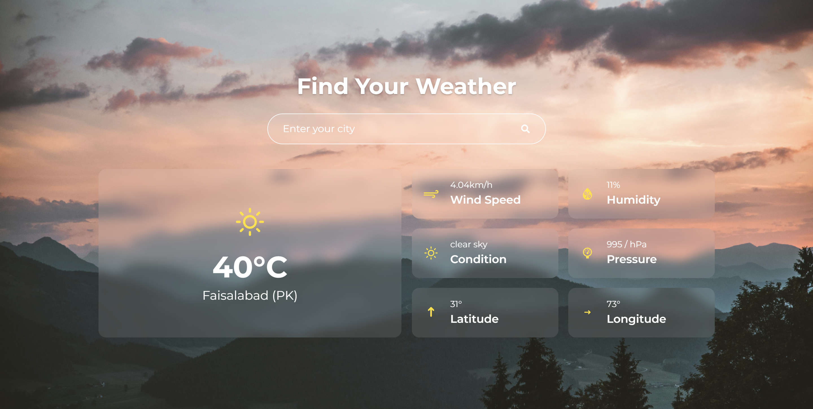

# 🌤️ Weather App

A responsive weather application built with **React** and **Vite**, showcasing weather conditions using reusable UI components and weather icons.



## 🚀 Features

- 🔍 **City Search** – Search weather by city with live updates
- 🌡️ **Main Weather Display** – Current temperature, condition, and location
- 📊 **Detailed Stats** – Wind speed, humidity, pressure, and more
- 📱 **Responsive UI** – Mobile-first design with clean layout
- 🎨 **Stylish Interface** – Tailwind CSS and Framer Motion for a dynamic feel

## 🛠️ Tech Stack


| Tech                          | Description                                      |
|-------------------------------|--------------------------------------------------|
| [React](https://reactjs.org/)             | UI library for building user interfaces         |
| [Vite](https://vitejs.dev/)              | Fast frontend build tool for modern web apps    |
| [TypeScript](https://www.typescriptlang.org/) | Superset of JavaScript adding static typing     |
| [Tailwind CSS](https://tailwindcss.com/) | Utility-first CSS framework for fast styling    |
| [Axios](https://axios-http.com/)         | Promise-based HTTP client for API communication |
| [Framer Motion](https://www.framer.com/motion/) | Animation library for React                     |
| [React Icons](https://react-icons.github.io/react-icons/) | Icon library for React                          |
| [OpenWeather API](https://openweathermap.org/api) | Real-time weather data provider   

---

## 📦 Installation

```bash
# Clone the repository
git clone https://github.com/your-username/weather-app.git
cd weather-app

# Install dependencies
npm install

# Run the app locally
npm run dev
